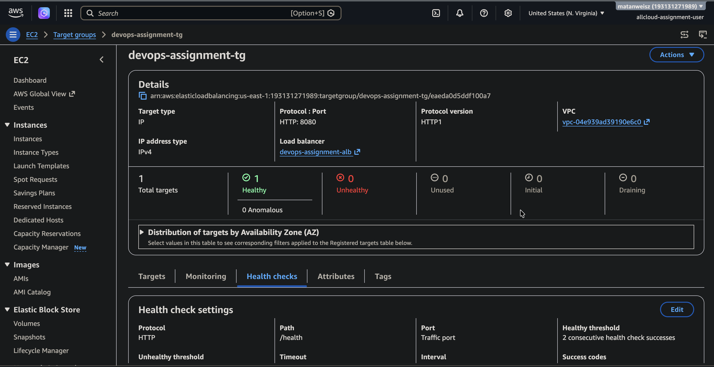
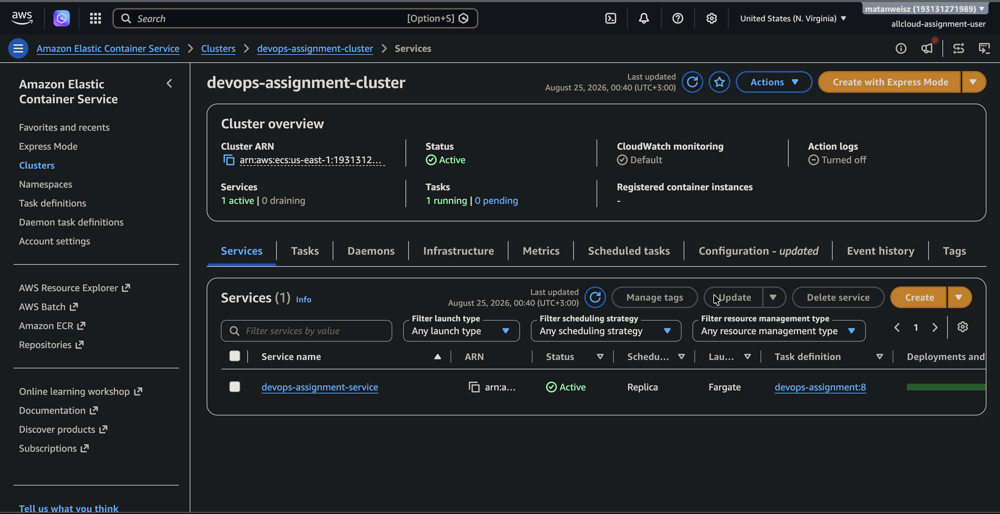
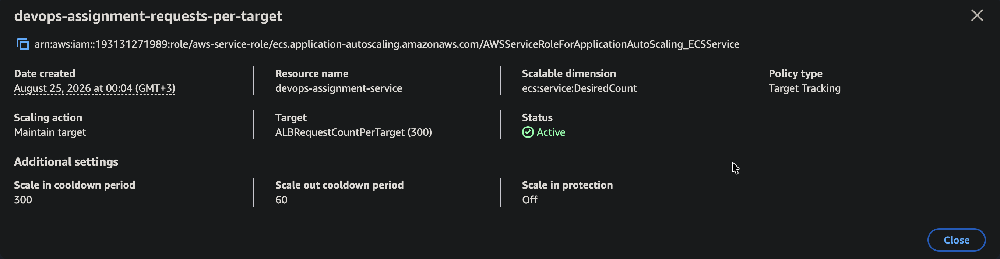

# DevOps home assignment: submission

Matan Weisz, August 2026.

A Flask app on ECS Fargate behind an Application Load Balancer, provisioned by Terraform.
It arrived broken in several places. This document covers what was wrong, how each fault
was found, and what was changed.

The end state, in one line: `curl` from a non-AWS address returned 200, the target group
held one healthy target, and the service reported `has reached a steady state.` The stack
was then destroyed per the brief's cost note, so the DNS name below no longer resolves.

## How to navigate this

| | |
|---|---|
| The brief | [`allcloud-devops-home-assignmnet.pdf`](allcloud-devops-home-assignmnet.pdf) |
| Proof it ran | [curl 200 + healthy target](#proof-it-ran) |
| What was broken | [twelve faults, six layers](#what-was-broken) |
| Secrets Manager | [Part 2, item 1](#part-2-item-1-secrets-manager) |
| Autoscaling | [Part 2, item 2](#part-2-item-2-autoscaling) |
| Q3 and Q4 | [Fargate vs EC2 vs EKS](#question-3-fargate-ecs-on-ec2-or-eks), [code review flag](#question-4-one-thing-to-flag-in-code-review) |
| Raw evidence | [`evidence/`](evidence/), one file per finding |
| Infrastructure | [`terraform/`](terraform/) |
| Pipeline | [`.github/workflows/deploy.yml`](.github/workflows/deploy.yml) |
| Baseline, before any fix | `git show bdd007f` |
| **Screen recording** | **[Diagnosing the deployment failure](https://drive.google.com/file/d/1W4JC_OY406G1K4QHH3W6Zs0sNPR5A27q/view?usp=sharing)**, sequence explained [below](#screen-recording) |

Every bug below links to an evidence file containing the commands run, the verbatim output,
and the reasoning. Evidence files are numbered in the order things were found, not by the
fault numbers below, which is why bug 6 points at evidence 02 and 08. The commit history
follows the same order, one branch per fix.

## Approach

Two rules I held to, both taken from the brief.

**Evidence before fix.** For each fault, the raw symptom was captured before anything was
changed. Once a bug is fixed the evidence is gone, and recreating it means breaking
production again.

**One change per deployment.** Where two faults sat on the same code path, they were fixed
one at a time so that each change could be attributed. This cost extra deployment cycles
and was worth it. Bugs 4 and 5 below are the clearest example: they affect the same API
call, and fixing them together would have repaired the second without ever observing it.

Bugs 1 to 3 were found before spending anything on AWS: the port mismatch was noticed
reading the code, then both it and the health check path were confirmed by building and
running the container locally. That was deliberate. Building and running the image takes
thirty seconds and answers questions that a deployment answers in five minutes.

---

## What was broken

Twelve faults across six layers. `terraform validate` passes on the original configuration,
so none of them are reachable by static analysis.

| # | Layer | Fault | Evidence |
|---|---|---|---|
| 1 | Container | `EXPOSE 5000`, app binds 8080 | [01](evidence/01-port-mismatch.md) |
| 2 | IaC | `container_port = 5000` across four places | [01](evidence/01-port-mismatch.md) |
| 3 | IaC | health check path `/healthz`, app serves `/health` | [03](evidence/03-health-check-path.md) |
| 4 | Networking | `assign_public_ip = false`, no NAT, no endpoints | [04](evidence/04-task-networking.md), [05](evidence/05-first-deploy-no-route-to-ecr.md) |
| 5 | IAM | execution role missing `ecr:GetAuthorizationToken` and `logs:*` | [06](evidence/06-execution-role-missing-permissions.md) |
| 6 | Deployment | grace period 5s against a 25s startup | [02](evidence/02-startup-time.md), [08](evidence/08-rollback-loop.md) |
| 7 | Deployment | `wait_for_steady_state` unset, so a failed deploy reports success | [08](evidence/08-rollback-loop.md) |
| 8 | CI/CD | `terraform apply` runs before `terraform init` | [09](evidence/09-pipeline.md) |
| 9 | CI/CD | Terraform applies before any image has been pushed | [09](evidence/09-pipeline.md) |
| 10 | CI/CD | `docker login` has no password, `ECR_REGISTRY` is never defined | [09](evidence/09-pipeline.md) |
| 11 | CI/CD | image pushed to a bare name, so Docker resolves it to Docker Hub | [09](evidence/09-pipeline.md) |
| 12 | CI/CD | long-lived access keys instead of OIDC | [09](evidence/09-pipeline.md) |

---

### 1 and 2. The port

**Symptom.** Nothing to see at first. The Dockerfile carried a comment that contradicted
the line below it:

```dockerfile
# NOTE: app.py listens on 8080 - check this matches what's below
EXPOSE 5000
```

**How it was traced.** Built the image unmodified and asked the running process which port
it had open, rather than trusting either the Dockerfile or the source:

```console
$ docker exec dvbase python -c "import socket;s=socket.socket();print(s.connect_ex(('127.0.0.1',8080))==0)"
True
$ docker exec dvbase python -c "import socket;s=socket.socket();print(s.connect_ex(('127.0.0.1',5000))==0)"
False
```

**Cause.** The app binds 8080. The `container_port` variable defaulted to 5000 and fed the
container port mapping, the service's load balancer block, the target group port and the
task security group ingress rule. One wrong default reached four places.

**Fix.** Moved the infrastructure to 8080 rather than moving the app to 5000. The app is
internally consistent and states 8080 in two comments.

`EXPOSE` is metadata. It opens no ports and changes no behaviour, so correcting it fixes
nothing on its own. It was corrected because it is almost certainly the line that misled
whoever wrote the Terraform. It is listed as a documentation defect, not a functional one.

### 3. The health check path

**Symptom.** Would have been an unhealthy target that never recovers, indistinguishable at
a glance from the port fault above.

**How it was traced.** Asked the container for all three paths directly:

```console
/          -> HTTP 200
/health    -> HTTP 200
/healthz   -> HTTP 404
```

**Cause.** The target group checks `/healthz` with `matcher = "200"`. Flask returns 404.
Every check fails, permanently.

**Fix.** `/healthz` to `/health` in `alb.tf`.

These two had to be fixed together. Repairing only the port still leaves an unhealthy
target, which reads as the port fix having failed.

### 4. The task had no route to ECR

**Symptom.** First real deployment. `terraform apply` returned success in two seconds and
exited 0. The service then never started a task.

```
stopCode:      TaskFailedToStart
stoppedReason: ResourceInitializationError ... operation error ECR: GetAuthorizationToken,
               StatusCode: 0, dial tcp 44.213.79.104:443: i/o timeout
startedAt:     null
```

The task sat PENDING for four and a half minutes before dying, 4m 31s of it between pull
start and stopping.

**How it was traced.** Three details did the work. `StatusCode: 0` means no HTTP response
ever arrived, so the failure is below the application layer. The four minute duration means
something was retrying and timing out, rather than being refused. And `startedAt: null`
means no container ever ran, which also explains an empty CloudWatch log group. That last
point matters: an empty log group here is not a logging fault, it is the absence of
anything to log.

**Cause.** The task ran in a public subnet whose route table sends `0.0.0.0/0` to an
internet gateway, with `assign_public_ip = false`. An internet gateway translates between a
public and a private address. With no public address there is nothing to translate, so the
subnet's route is unusable. Verified against the account in
[evidence 04](evidence/04-task-networking.md) before the deployment confirmed it.

**Fix.** `assign_public_ip = true`. A NAT gateway would cost roughly $32/month and there
are no private subnets in the default VPC to place tasks in. VPC interface endpoints for
`ecr.api`, `ecr.dkr` and `logs` plus an S3 gateway endpoint would keep the traffic off the
public internet and are the right answer in a production account, at the cost of four more
resources for no benefit in this exercise.

One accepted risk stays in the config: the service places tasks across all six default
subnets, including `us-east-1e`, a zone with historically limited Fargate support. It never
misplaced a task during this work, so it was left alone rather than fixed preemptively; the
observation is recorded in [evidence 04](evidence/04-task-networking.md).

### 5. The execution role could not authenticate to ECR

**Symptom.** Fixing the network did not make the task start. It changed the error.

This one was suspected before the deployment: the previous owner's own comment in `iam.tf`
says "double check this actually covers everything ECS needs", and reading the policy
against the documented pull sequence showed the token action missing. The deployment was
still run with only the network fix, deliberately, so the IAM failure could be observed on
its own rather than assumed.

| | Before the network fix | After |
|---|---|---|
| Time to fail | 4m 31s | 32s |
| HTTP status | `StatusCode: 0` | `StatusCode: 400` |
| Error | `i/o timeout` | `AccessDeniedException` |

```
is not authorized to perform: ecr:GetAuthorizationToken on resource: *
because no identity-based policy allows the ecr:GetAuthorizationToken action
```

**How it was traced.** The timing change alone said the network fix had worked before the
message was read. Timeouts are slow, refusals are fast. `StatusCode: 0` against
`StatusCode: 400` is the field that separates a network fault from a permissions fault:
zero means nothing answered, 400 means ECR answered and refused.

**Cause.** The hand-rolled policy granted `BatchCheckLayerAvailability`,
`GetDownloadUrlForLayer` and `BatchGetImage`, which are the actions for pulling image
layers once you hold a registry token. Obtaining the token is a separate action,
`ecr:GetAuthorizationToken`, and it was absent. `logs:CreateLogStream` and
`logs:PutLogEvents` were also missing, and had not failed yet only because no container had
ever started.

The file carried a comment from the previous owner saying "double check this actually
covers everything ECS needs." It did not.

**Fix.** Rewrote the policy as three scoped statements.

`GetAuthorizationToken` stays on `*` because it is an account-level action that returns a
token for the whole registry, and ECR does not support resource-level permissions for it.
Scoping it to a repository ARN produces a policy that silently never matches.

The pull actions were narrowed from `*` to this repository only.

Log writes are scoped to this log group, including a `:*` suffix. Terraform's
`aws_cloudwatch_log_group.arn` attribute omits that suffix while IAM evaluates against the
ARN that includes it. This was verified rather than assumed, because without it the policy
looks correct in review and grants nothing at runtime.

The AWS managed `AmazonECSTaskExecutionRolePolicy` covers all of this in one line and is
the usual recommendation. It was not used because it grants every action on `*`, and
because Part 2 adds Secrets Manager access to this same role, so a custom policy has to
exist either way.

### 6 and 7. The deployment that reports success and never settles

This is the fault that cannot be found by reading the files. Full write-up with timings in
[evidence 08](evidence/08-rollback-loop.md), and a screen recording of the diagnosis is
linked below.

**Symptom.** `terraform apply` exits 0. The service then starts a task, the target is
registered, the target is declared unhealthy, ECS kills the task, and the cycle repeats.
`curl` against the load balancer returns 503 throughout. After three failures the
deployment circuit breaker trips and rolls back.

**How it was traced.** The decisive line is a service event:

```
(task 795dee6c...) (port 8080) is unhealthy in (target-group ...)
due to (reason Health checks failed with these codes: [404])
```

AWS names the status code, and that single detail eliminates three hypotheses at once. A
wrong container port produces a timeout. A security group blocking the load balancer
produces a timeout. A crashed container produces a refused connection. A 404 means the
request reached Flask and Flask did not recognise the path, so everything below the
application layer is working.

Confirmed from the other side in the application's own access log, showing four load
balancer node addresses hitting `/healthz` in the same second and receiving 404.

**Cause, and a distinction worth making.** Two separate defects live here, and only one of
them was causing this failure.

The health check path is what killed these tasks. It fails permanently.

The grace period is set to 5 seconds against an application that sleeps 25 seconds before
binding a socket. It is genuinely wrong, but it is **not** what caused this outage, and
saying otherwise would be wrong. The load balancer requires `unhealthy_threshold ×
interval`, or 45 seconds of consecutive failures, before reporting a target unhealthy. The
app is unavailable for 25. On a normal startup the target never reaches `unhealthy`, so the
grace period never gets a chance to apply.

What makes it worth fixing anyway is how close it came. On an earlier successful
deployment the load balancer health checked a socket that was not yet open for 17 seconds,
which is two failed checks out of the three required. One more failed check and that task
dies. A slower image pull, a shorter interval, or a few more seconds of application startup
turns this into an intermittent failure that nobody connects to a comment about deploys
feeling faster.

**Fix.**

| Change | Value |
|---|---|
| health check path | `/healthz` to `/health` |
| `health_check_grace_period_seconds` | 5 to 90 |
| `wait_for_steady_state` | added, `true` |

AWS publishes no formula for the grace period, so the following is engineering judgment
with the arithmetic shown rather than a documented recommendation:

```
minimum = startup + (interval × unhealthy_threshold) = 25 + (15 × 3) = 70 seconds
```

70 is the floor at which a task cannot be killed for being slow. 90 leaves headroom for
image pull and ENI attachment, neither of which is in the 25 second figure.

`wait_for_steady_state = true` is the change that matters most for whoever inherits this.
It makes Terraform behave like `aws ecs wait services-stable` and fail the apply instead of
reporting success while the service loops. The entire cost of this fault was that a green
apply meant nothing.

**One further observation.** The circuit breaker rolled back and it did not help, because a
rollback reverts the **task definition**, and the fault was in the **target group**, which
no task definition contains. ECS rolled back to a task definition that was never the
problem and the replacement tasks failed identically. The circuit breaker protects against
a bad image. It offers nothing against a misconfigured load balancer.

---

### 8 to 12. The deployment pipeline

The brief says the pipeline does not need to run, and that reasoning it through and showing
the corrected file is enough. Corrected file:
[`.github/workflows/deploy.yml`](.github/workflows/deploy.yml). Full write-up:
[`evidence/09`](evidence/09-pipeline.md).

Five faults. Four are fatal, the fifth works fine and is still the one most worth changing.

**8. `apply` before `init`.**

```yaml
- name: Terraform apply
  run: terraform apply -auto-approve
- name: Terraform init
  run: terraform init
```

The job dies on the first step and the step that would have fixed it never runs. Worth
treating as a signal rather than a typo: these steps are in the order someone thought of
them, not the order they need to happen. That makes the ordering of everything else in the
file suspect, and it is.

**9. Applying before the image exists.** Even with `init` moved up, the first apply creates an
ECS service pointing at a repository created seconds earlier and empty.

There is no circular dependency in Terraform. The graph is fine. The problem is that pushing
an image is not a Terraform resource, so it cannot be sequenced. Resolved by creating the
repository on its own, pushing, then applying the rest:

```yaml
- run: terraform apply -auto-approve -target=aws_ecr_repository.app
- # build and push
- run: terraform apply ... -var="image_tag=$GITHUB_SHA"
```

`-target` carries a warning about not being for routine use, and that warning is fair. This is
the case it exists for: a dependency that leaves Terraform's graph and comes back. It is also
a first-run problem only.

**10. The ECR login cannot work.** `docker login --username AWS ${{ env.ECR_REGISTRY }}`: that
variable is never defined anywhere in the file so it expands to empty, and a username with no
password either prompts, hanging the runner, or fails. Replaced with
`aws-actions/amazon-ecr-login@v2`, which exposes the registry as `steps.ecr.outputs.registry`.

**11. The image goes to Docker Hub.** `docker push $ECR_REPOSITORY:latest` pushes
`devops-assignment:latest`, an unqualified name, which Docker resolves against Docker Hub
rather than ECR. Fixed to the fully qualified URI.

Also added `--platform linux/amd64`. The task definition leaves `runtimePlatform` unset, so
Fargate runs it as X86_64; a build on an ARM machine produces an image that pushes and pulls
fine and then fails to execute with an error that never mentions architecture. The runner is x86 so this changes nothing in CI, which is the point: a local
build should behave the same way.

**12. Long-lived access keys.** This one works, and is still the thing most worth changing.

A static key pair sits in GitHub secrets indefinitely, works from anywhere for anyone who
obtains it, keeps working after the job that leaked it ends, and is rotated by hand, which
means it is not rotated. Replaced with OIDC: GitHub mints a token per run, AWS exchanges it
for credentials that expire in about an hour, and the trust policy scopes which repository and
branch may assume the role.

```json
"StringLike": {
  "token.actions.githubusercontent.com:sub": [
    "repo:matanweisz/allcloud-assignment:ref:refs/heads/main",
    "repo:matanweisz/allcloud-assignment:pull_request"
  ]
}
```

Without that condition on `sub`, any repository on GitHub could assume the role. The second
entry exists because GitHub sends a `pull_request` subject for PR runs, not the branch form;
a trust policy with only the branch entry silently breaks the plan-on-PR flow.

**Also changed:** a `permissions:` block, which was absent entirely and which OIDC requires
(`id-token: write`). A `concurrency` group with a fixed name, because every run mutates the
same AWS resources and a per-ref group would let two runs race. `fmt -check` and `validate`
before anything is created. Plan on pull requests, with every mutating step (the ECR
bootstrap, the image push, the apply) gated to pushes on `main`, applying the exact plan
file produced rather than re-planning at apply time. And the image tagged with the git SHA
rather than `latest`, so every deploy produces a distinct task definition revision and a
rollback target.

**Deliberately not added:** a test step for an application with no tests, and the
`render-task-definition` / `deploy-task-definition` actions, which would give CI and Terraform
the same job and guarantee they drift.

**Still missing, and said out loud rather than hidden:** a remote state backend, and the
OIDC provider plus CI role themselves. With no `backend` block the state in CI would live
and die with the runner, so this workflow can succeed against a fresh account exactly once;
the first change before running it for real is an S3 backend with `use_lockfile = true`,
which is also what puts the Terraform state, and the generated database password inside it,
behind encryption at rest. And `secrets.AWS_ROLE_ARN` names a role this configuration does
not create: the role a pipeline assumes should not be created by the pipeline it
authorizes, and since the brief allows reasoning the pipeline through rather than running
it, that one-time account bootstrap was never performed. The workflow is honest about
this at runtime too: `fmt`, `validate` and the bootstrap check run on every push with no
credentials, and the deploy job skips cleanly when the role ARN secret is absent instead
of failing every run. Both gaps are spelled out in
[`evidence/09`](evidence/09-pipeline.md).

---

## Proof it ran

Full capture in [`evidence/07`](evidence/07-working-end-to-end.txt). The essentials:

```console
$ curl -i http://devops-assignment-alb-1419604975.us-east-1.elb.amazonaws.com/
HTTP/1.1 200 OK
Content-Type: application/json

{"hostname":"ip-172-31-75-214.ec2.internal","message":"hello from devops-assignment","version":"1.0.0"}
```

Called from a laptop on `5.29.11.119`, which is not an AWS address. The brief notes that a
healthy target group is not by itself proof of external reachability, so both are recorded:

| | |
|---|---|
| Target | `172.31.75.214:8080`, `us-east-1f`, **healthy** |
| Service | desired 1, running 1, pending 0, rollout **COMPLETED** |
| Grace period | 90 |
| ECS service event | `has reached a steady state.` |



Target group `devops-assignment-tg`: 1 total target, 1 healthy, 0 unhealthy. Health check on
`/health`, protocol HTTP, target type IP, port 8080.



Cluster `devops-assignment-cluster`: 1 active service, 1 running task, 0 pending, launch type
Fargate, on task definition revision `devops-assignment:8`.

The service event is the line that matters against the brief's "applies cleanly once and then
never reaches a stable state doesn't count." With `wait_for_steady_state = true`, the apply
itself blocked for close to three minutes waiting for that event rather than returning in two
seconds.

The stack was destroyed after these captures, per the brief's cost note, so the DNS name
above no longer resolves. Everything in this section is reproducible with
`terraform apply` plus the bootstrap sequence in [`evidence/09`](evidence/09-pipeline.md).

---

## Part 2, item 1: Secrets Manager

Full capture in [`evidence/10`](evidence/10-secrets-manager.txt).

The password moved out of `variables.tf` entirely and into Secrets Manager, injected through
the task definition's `secrets` block rather than `environment`:

```json
"environment": [ { "name": "APP_VERSION", "value": "1.0.0" } ],
"secrets": [ {
    "name": "DB_PASSWORD",
    "valueFrom": "arn:aws:secretsmanager:us-east-1:193131271989:secret:devops-assignment/db-password-6DLcHb"
} ]
```

Verification that the value is genuinely absent, rather than just moved:

```console
$ aws ecs describe-task-definition --task-definition devops-assignment --output json | grep -c "$SECRET"
0
```

The `-6DLcHb` suffix is six random characters Secrets Manager appends at creation. It differs
per secret and is case sensitive, which is why the ARN is taken from the resource attribute
rather than constructed by hand.

The execution role can read exactly one secret:

```json
{
  "Sid": "ReadDbPassword",
  "Action": ["secretsmanager:GetSecretValue"],
  "Resource": "arn:aws:secretsmanager:us-east-1:193131271989:secret:devops-assignment/db-password-6DLcHb"
}
```

**Proof it works:** a task is RUNNING on revision 8 of the task definition. That is the proof,
not a separate check. ECS resolves secrets during task setup and fails the task with
`ResourceInitializationError` if the execution role cannot fetch them. A task that reaches
RUNNING has necessarily had the secret injected.

Two details worth stating. The **execution role** resolves secrets, not the task role, because
resolution happens before the container starts. And no `kms:Decrypt` statement is needed
because the secret uses the default `aws/secretsmanager` key; a customer managed key would
require it.

---

## Part 2, item 2: autoscaling

Configuration in [`evidence/11a`](evidence/11a-autoscaling-config.txt), the measurement behind the
metric choice in [`evidence/11`](evidence/11-autoscaling-metric-choice.md).

```
scalable target:  min 1, max 4, ecs:service:DesiredCount
policy:           TargetTrackingScaling, ALBRequestCountPerTarget, target 300
cooldowns:        60s out, 300s in
```

Application Auto Scaling creates the alarm pair itself, with the low alarm 10% under the
target as built-in hysteresis. One honesty note on the linked capture: `evidence/11a` was
taken before the load test below, so it shows the alarm pair at the original guessed target
of 600 (alarms 600/540). The measurement forced the correction to 300, which was applied and
is what the screenshot and `terraform/variables.tf` show; the stack was destroyed before
anyone thought to re-run the CLI capture. The capture is kept because the alarm mechanics it
demonstrates are the same at either value.



Policy `devops-assignment-requests-per-target`: target tracking on
`ALBRequestCountPerTarget (300)`, scalable dimension `ecs:service:DesiredCount`, status
Active, scale-in cooldown 300s, scale-out cooldown 60s.

### Why requests per target and not CPU, with the number

The brief asks for a real number from this deployment. Load was generated against the ALB
while the service ran a single task, and all figures below are server-side from CloudWatch
rather than from the load generator.

| req/min per target | avg response | p95 response | **CPU max** | Memory |
|---|---|---|---|---|
| 19 | 3.6 ms | 10.8 ms | 0.76% | 4.10% |
| 20 | 4.4 ms | 16.6 ms | 1.12% | 4.10% |
| 78 | 1.6 ms | 3.0 ms | **0.24%** | 4.10% |
| 80 | 2.0 ms | 5.3 ms | **0.31%** | 4.10% |
| **917** | **318 ms** | **606 ms** | **1.92%** | **4.10%** |

That is the full table from [evidence 11](evidence/11-autoscaling-metric-choice.md),
including the two rows that do not fit a tidy curve: the 19 and 20 req/min samples show
higher CPU and p95 than the 78 and 80 ones. Load was generated in bursts, and CloudWatch
averages over 60 second periods, so a short burst inside a mostly idle minute reads
differently from a steady one. The comparison below uses the clean low points and the
saturated high point.

Between 80 and 917 requests per minute, **p95 response time rose about 114x** while **CPU went
from 0.31% to 1.92%** and memory did not move at all.

The structural reason comes first, because it connects to the code review answer below: the
app runs on the Werkzeug development server and serializes a trivial JSON document. Nothing
is compute-bound. What runs out is concurrency, so requests queue and the CPU stays idle
waiting rather than working. A queue-bound service keeps its CPU flat no matter how bad
things get, so a CPU alarm has no signal to act on.

The measurement illustrates just how flat. Even reading the 1.92% figure generously and
extrapolating linearly, a 50% CPU target would need roughly:

```
917 x (50 / 1.92) = ~23,900 requests per minute per task
```

Around 25 times the load that already pushed p95 past 600 ms. **A CPU policy would never fire
before the service was unusable**, while showing a green alarm the whole time. That is worse
than no policy, because it looks like it works.

### The target value, and what I don't know

300 req/min per target. 917 produced an unacceptable 606 ms p95; 78 to 80 produced 3 to 5 ms.
300 is a third of the measured degradation point, chosen conservatively because the curve is
steep rather than gradual, and because an unnecessary task costs about a cent an hour.

**The knee was not located precisely.** Generating clean intermediate load from a laptop in
Israel against us-east-1 was not possible: the first attempt returned 5 second response times
at a concurrency of one, which is not credible against a 0.31 s idle request. The cause was
local socket exhaustion on the client after the high concurrency run. Every figure above is
therefore taken from `TargetResponseTime`, which measures the target rather than the round
trip. Worth remembering generally: when a load test returns implausible numbers, suspect the
generator before the target.

An earlier commit set this to 600. That was a guess made before measuring, and the
measurement showed it sits too close to the degradation point. Corrected rather than left as
whatever happened to be committed first.

### How I would validate it properly

Load generated from inside the VPC to remove round trip time and client limits. A step ramp
holding each level for five minutes so CloudWatch's 60 second periods get several clean
samples. The knee read against an explicit p95 SLO, with the target set at about 70% of it.
Then confirm the policy actually fires: alarm into ALARM, a recorded scaling activity, and
`desiredCount` increasing. Configuration existing is not the same as configuration working.

Full detail in [`evidence/11`](evidence/11-autoscaling-metric-choice.md).

---

## Screen recording

**[Diagnosing the deployment failure](https://drive.google.com/file/d/1W4JC_OY406G1K4QHH3W6Zs0sNPR5A27q/view?usp=sharing)** (Google Drive, viewable without signing in)

Unedited, single take, working through the deployment that applies cleanly and never settles.

On sequence, because the commit history shows it and the write-up should match: the port
mismatch and the health check path were both found before the first AWS deployment, the port
by reading the code and the path by running the container locally. That is why neither
appeared as a deployment failure. To record the deployment-time behaviour the brief asks
about, the health check path was deliberately put back on a throwaway branch
(`repro/deployment-rollback`, not merged) and the failure reproduced against the real
service. Everything shown in the recording is live: real infrastructure, real task failures,
real service events.

What it covers:

- a clean `terraform apply` that proves nothing, and why `wait_for_steady_state = false` is
  the reason
- `curl` returning 503 from outside the VPC
- an incorrect first hypothesis (the container is crashing), corrected by observing that
  tasks were starting rather than failing to start
- the service event naming the exact status code, `Health checks failed with these codes:
  [404]`, and what a 404 rules out that a timeout would not
- confirming the same fact from the application's own access log
- a second incorrect hypothesis (the grace period), corrected by working the arithmetic out
  loud: 3 x 15 = 45 seconds to be declared unhealthy against a 25 second startup, so the
  grace period could not have been the cause

---

## Question 3: Fargate, ECS on EC2, or EKS

**ECS on Fargate, and I would move it to ARM64.** Same answer as what is running, reached
by working out the numbers rather than by defending the status quo.

The workload is one Flask container at 0.25 vCPU and 0.5 GB, scaling between 1 and 4 tasks,
maintained long-term by a small team.

### The number that decides it

Fargate compute for this service, us-east-1, 730 hours:

```
(0.25 vCPU x $0.0404784) + (0.5 GB x $0.004446) = $0.01234/hr = $9.01/month
```

The Application Load Balancer in front of it costs `$0.0225/hr = $16.43/month` before a
single LCU.

**The load balancer costs more than the compute it balances.** That single fact settles the
argument, because the ALB is identical in all three options. Any cost comparison between
Fargate, EC2 and EKS here is an argument about a number smaller than the fixed cost sitting
next to it.

### Why not ECS on EC2

Per vCPU, EC2 is genuinely cheaper. A t4g.medium is $0.0168/vCPU-hr against Fargate's
effective $0.04937/vCPU-hr at the same memory ratio, so roughly **2.9x cheaper at perfect
packing**. Anyone claiming Fargate is cheaper per unit of compute is wrong.

It does not win here, because you buy whole instances rather than vCPUs:

| Option | Monthly |
|---|---|
| 1 Fargate task | $9.01 |
| 4 Fargate tasks (the max) | $36.04 |
| 1 x t4g.small + 30 GiB gp3 | $14.66 |
| 2 x t4g.small (surviving one AZ) | $29.32 |

Below two tasks EC2 is more expensive than Fargate. With the second instance that AZ
redundancy actually requires, EC2 only wins above four tasks, which is this service's
ceiling. **At maximum scale, EC2 saves about $7 a month.**

In exchange for that $7, the team takes on AMI patching, ECS agent and container runtime
upgrades, an auto scaling group with a capacity provider, instance draining on scale-in,
and right-sizing. AWS changed the ECS-optimized AMI in June 2024 so that it no longer
updates packages at launch, making the patching cadence explicitly the operator's problem,
and the Amazon Linux 2 variant reaches end of life on 30 June 2026. That is a migration
this team would already own.

Seven dollars a month is around fifteen minutes of engineer time. The first AMI migration
costs more than a year of the saving.

### Why not EKS

The EKS control plane is `$0.10/hr = $73/month` before a single node runs. That is **eight
times the entire compute bill** for a service that would otherwise cost $9.

Cost is not the real objection. The cadence is. Kubernetes minor versions land roughly
every four months with 14 months of standard support, then 12 months of extended support at
six times the control plane price. At the end of extended support AWS auto-upgrades the
control plane, and node groups are explicitly not upgraded with it. That is a recurring
upgrade project, forever, for one container serving a JSON document. Add the addon
lifecycle, an ingress controller to install and maintain, and IRSA or Pod Identity for
workload permissions.

EKS buys portability and an ecosystem. Neither is a stated requirement, and neither is free.

### Why Fargate is right rather than merely adequate

Nothing in this workload touches a Fargate limitation. Fargate cannot do privileged
containers, GPUs, host networking, daemon scheduling, `devices` or `tmpfs`. A stateless
Flask app behind an ALB needs none of them. EBS and EFS are supported, so even state would
not force a move.

And the evidence from this exercise is direct: across roughly two hours of active
debugging, every problem was mine. Wrong port, wrong health check path, missing egress,
missing IAM permission, a grace period that did not match the app. **Not one of them was a
host problem**, because there was no host to have problems. On EC2 the same session would
have included at least the question of whether the instance was healthy, which is a
hypothesis I never had to form or rule out.

The ARM64 move is the one change worth making. Fargate on Graviton is about 20% cheaper for
identical behaviour, taking this to $7.21/month. It costs one line in the task definition
and a `linux/arm64` build.

### What would make this answer wrong

Saying "Fargate is cheaper" without qualification, because per vCPU it is not. Saying "EKS
scales better", because ECS autoscales on the same Application Auto Scaling signals and
nothing here approaches a scaling ceiling in either. Saying "Kubernetes is the standard",
which is a preference wearing a justification. And any cost argument that never mentions
the load balancer, which is larger than the entire compute delta and identical in all three
cases.

## Question 4: one thing to flag in code review

**The application is served by the Werkzeug development server.**

```python
if __name__ == "__main__":
    app.run(host="0.0.0.0", port=8080)
```

It is not broken. It serves correct responses, passes health checks, and returned 200 from
outside the VPC throughout. Nothing in this assignment fails because of it.

I would flag it because the software says so itself. From our own CloudWatch logs, on every
task start:

```
WARNING: This is a development server. Do not use it in a production deployment.
Use a production WSGI server instead.
```

When a dependency prints a warning about its own suitability every time it starts, and the
deployment ships anyway, the warning has been normalised. That is worth naming in review
even when nothing is currently failing.

The concrete consequences: a single process with unbounded threads rather than a bounded
worker pool, so no recovery from a wedged process and no backpressure. No request timeouts,
so one slow client holds a connection. No limit on request line or header size. No graceful
shutdown handling, which matters on ECS: at task stop the target is deregistered and drained
first, then the container receives SIGTERM, and SIGKILL follows after the stop timeout, 30
seconds by default. A server that ignores SIGTERM burns the whole window and gets killed
mid-connection.

It also connects to a decision made elsewhere in this repo. The autoscaling metric is
requests per target rather than CPU, precisely because this server's constraint is
concurrency rather than processor time. The development server is the reason CPU is a poor
signal here. Two apparently unrelated choices trace back to the same line.

The fix is small, which is part of why it is worth raising: add `gunicorn` to
`requirements.txt` and change the Dockerfile's `CMD` to
`gunicorn --bind 0.0.0.0:8080 --workers 2 app:app`.

It was left alone deliberately. The brief asked for one thing flagged in review, not
changed, and modifying application behaviour beyond what was needed to make the deployment
work would have blurred the line between the bugs I was asked to find and improvements I
decided to make.

Runners-up, for completeness: no HTTPS listener, so credentials would cross the internet in
plaintext if this ever carried any; and `aws_iam_role.ecs_task_role` is created with no
policy attached and referenced by the task definition, which is harmless now and becomes a
trap the moment someone assumes it grants something.
